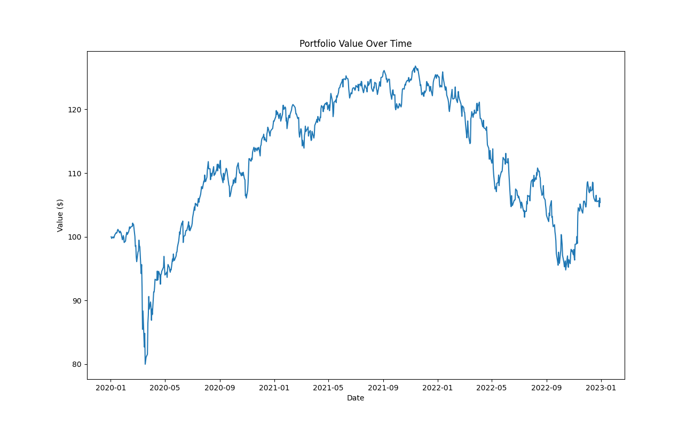

# PredictNow.ai Assignment

**Backtesting a portfolio of five ETFs using Inverse Volatility Method**

---

**Theoretical Topics:** *Inverse Volatility method, Sharpe Ratio, CAGR*

**Tools / Technologies:** *Python, Pandas, Matplotlib*

---

## Implementation and Repo Explanation:

As per the assignments deliverables requirements, there are a few outputs which I have described below.

- Python Code Comments -- [backtest.py](https://github.com/harshp30/PredictNowAIAssignment/blob/main/backtest.py) 
    - This is the Python file within which all of the code is written
    - I have tried my best to add detailed comments whenever I could
    - Each function has a comment block describing the function, parameters, and returns

- Portfolio Value over Time -- [portfolio_value.png](https://github.com/harshp30/PredictNowAIAssignment/blob/main/output/portfolio_value.png) 
    - This graph contains the portfolio value over time with an initial portfolio value of $100

        

- Rebalancing and Allocations CSV -- [portfolio_allocations.csv](https://github.com/harshp30/PredictNowAIAssignment/blob/main/output/portfolio_allocations.csv)
    - This cvs file contains the data for the allocation weights and date for each rebalancing period
    - The allocation weights sum to 1 (100%)

- Rebalancing and Allocations CSV -- [terminal_output.txt](https://github.com/harshp30/PredictNowAIAssignment/blob/main/output/terminal_output.txt)
    - This file contains the output from the terminal, including the Sharpe Ratio and CAGR.

        ```
        Starting Portfolio Value $ 100.0
        Ending Portfolio Value $ 105.38
        Max Portfolio Value $ 126.81
        Min Portfolio Value $ 79.98
        Sharpe Ratio: 0.011962677596691385
        Compound Annual Growth Rate (CAGR): 0.017659856151240882
        ```

- Given Assignment and Data -- [data/](https://github.com/harshp30/PredictNowAIAssignment/blob/main/data)
    - This folder contains the .csv files with the original OHLC ETF data for EEM, GLD, SPY, TLT, and VGK
    - I extract the data directly from this folder in the code

---

## Theoretical Explanation:

*What is the Inverse Volatility Method?*

> The Inverse Volatility Method is a portfolio weighting strategy in which highly volatile assets (in this case ETFs) are assigned smaller weights and assets with lower volatility are assigned larger weights.

*What is the Sharpe Ratio?*

> Sharpe Ratio is a financial metric that measures the performance of an investment. It describes how much excess return you are receiving for any extra volatility you endure holding a riskier asset.

`Sharpe Ratio = (Rp – Rf) / ơp`

- Rp = Expected rate of return of the portfolio
- Rf = Risk-free rate of return (set to 0)
- ơp = Standard deviation of the portfolio return

*What is CAGR?*

> Compound Annual Growth Rate (CAGR) is a metric used to measure a constant rate of return over a specific time period.

`CAGR = [(Vf/Vi)^(1/t)] - 1`

- Vi = Initial Portfolio Value (Set to 100)
- Vf = Final Portfolio Value
- t = Time in Years

